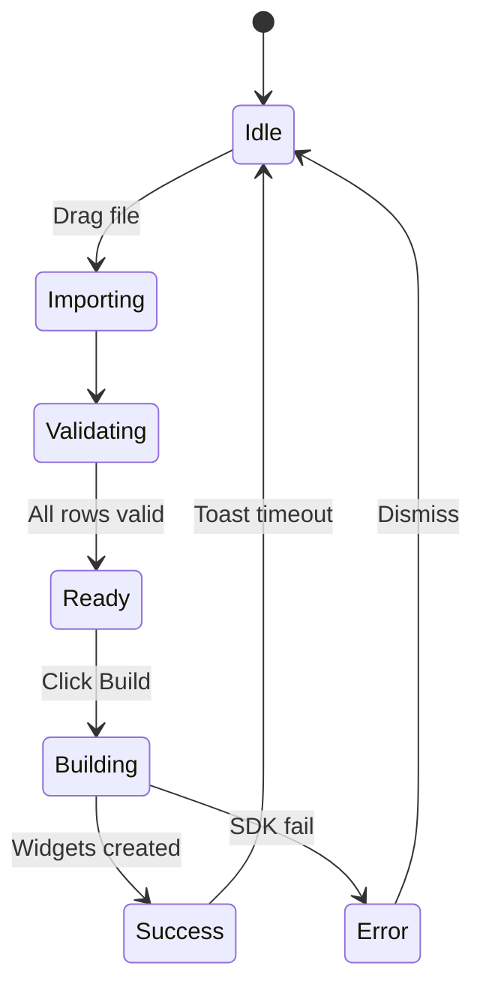

# Sidebar Tabs — Detailed Functional Blueprint

_Explicit UI + interaction walkthrough for every tab (June 2025)_

This document narrows focus to the **ten sidebar tabs** in the
Structured Diagramming add‑on. Each tab section specifies panel layout, visible
controls, states, interaction flows, tool‑tips, keyboard shortcuts, and
validation rules—so any developer can translate designs into code with zero
ambiguity.

---

## Legend

- **UI Element** – Visual component to render (exact Mirotone component/class).
- **Copy (EN‑AU)** – Literal text shown to users.
- **Interaction Flow** – Ordered user actions → system responses.
- **State Store** – Redux slice / React context field.
- **Shortcut** – Keyboard binding (Mac / Win).

---

## 1  Create Tab

| Step | UI Element               | Copy (EN‑AU)           | Interaction Flow                               | State Store   |
| ---- | ------------------------ | ---------------------- | ---------------------------------------------- | ------------- |
| 1    | `<Select>` mode dropdown | –                      | Choose **Diagram** or **Cards** mode           | `createMode`  |
| 2    | `<DropZone>` area        | "Drag a .json file"    | Drag file → highlight border; on drop validate | `importQueue` |
| 3    | Diagram mode options     | as per old Diagram tab | Layout settings + build button                 | –             |
| 4    | Cards mode options       | as per old Cards tab   | Search, tag filter and create button           | –             |

**Tooltip for invalid row** – "Edge refers to missing node '‘%id%’.'" Shortcut:
**⌘/** toggles the **Advanced options** accordion on the Diagram tab.

---

## 2\u00a0 Frames Tab

| Control           | Details                                         |
| ----------------- | ----------------------------------------------- |
| **Prefix Input**  | Text prefix used for renaming                   |
| **Rename Button** | Applies prefix in left\u2011to\u2011right order |

Flow: select frames, type prefix, press **Rename Frames** → titles become
`<prefix>0`, `<prefix>1`, ...

---

## 3  Resize Tab

Panel split vertically **(Stack space="lg")**

| Section               | UI Elements                                   | Copy                                       | Interaction                                   |
| --------------------- | --------------------------------------------- | ------------------------------------------ | --------------------------------------------- | --------------- |
| **Current Selection** | `<Text>` size readout (W × H px)              | “Selection: 180 × 120 px”                  | Updates on `selection:update`                 | `selectionSize` |
| **Copied Size**       | `<Text>` (grey if none)                       | “Copied: (none)” OR “Copied: 280 × 160 px” | Shows last copied dimensions                  | `copiedSize`    |
| **Presets**           | Buttons S/M/L, `<InputField>` Width + Height  | “Apply”                                    | Click preset or enter numbers → preview ghost | –               |
| **Aspect Ratio**      | `<Select>` Golden, 16:9, 16:10, 4:3           | “Free” default                             | Changing width or ratio updates height        | `ratio`         |
| **Copy Size**         | `<Button variant="secondary">Copy size`       | Copies `selectionSize` → `copiedSize`      | –                                             |
| **Apply Copied**      | `<Button variant="primary">Apply copied size` | Disabled if `!copiedSize`                  | Iterates selection; sets dimensions           |

Validation: warn if width/height > 10 000 px (“That’s bigger than your board
viewport”). Shortcut: **⌥C** copies size, **⌥V** applies.

---

## 4  Style Tab

Layout: single column Stack.

- **Brightness Slider** (−100 %–100 %) – down/up arrow changes by 1 %.
- Numeric input mirrors slider value.
- **Apply** button calls `tweakFillColor` with the selected adjustment.

This tab no longer exposes border or text options; use native Miro style tools
instead.

---

## 5  Grid Tab

| Control               | Details                          |
| --------------------- | -------------------------------- |
| **Columns Input**     | Numeric; min 1, max 20           |
| **Gap**               | Numeric spacing in px            |
| **Frame Title Input** | Optional; enables frame creation |
| **Preview Overlay**   | CSS grid lines, `opacity: 0.3`   |
| **Group Checkbox**    | “Group items into Frame”         |

Flow: Change value → overlay updates real‑time. Press **Arrange** creates frame
if enabled.

---

## 6  Templates Tab

Two‑pane Flex (`SidebarList` categories + `MasonryGrid` templates).

| Category List Item | Copy                         | Keyboard Nav                   |
| ------------------ | ---------------------------- | ------------------------------ |
| List button        | “Flowcharts”, “AWS”, “BPMN”… | Up/Down to move; Enter selects |

Template Card shows:

- Thumbnail 160×100
- Node count badge
- “Insert” button

Insert Flow: click → loads JSON → `GraphProcessor` → `BoardBuilder.sync` → opens
Rename modal.

---

## 7  Export Tab

| Export Type            | Fields                                                      | Default Values      |
| ---------------------- | ----------------------------------------------------------- | ------------------- |
| **PNG**                | Resolution dropdown (1×/2×), Background: Transparent toggle | 1×, Transparent OFF |
| **SVG**                | Include Comments checkbox                                   | OFF                 |
| **BPMN XML**           | Version dropdown (2.0/2.1)                                  | 2.0                 |
| **Markdown (Mermaid)** | Copy to clipboard only                                      | –                   |

Progress Bar: shows %; disable sidebar during export.

Error: if PNG > 16 k × 16 k px → show modal “Canvas too large; zoom or frame to
export.”

---

## 8  Data Tab (Live Bindings)

Wizard (Stepper):

1. **Select Source** – REST / CSV / WebSocket; URL/file input.
2. **Test Connection** – Ping and show latency badge (green < 200 ms, yellow
   < 500 ms, red otherwise).
3. **Field Mapping** – Drag API fields → node properties list.
4. **Activation** – Toggle “Live Update”; snackbar shows success.

Polling interval slider (2 – 300 s). State `dataBindings[{boardId}]`.

---

## 9  Comment Tab

- **Thread List** – Sidebar list grouped by widget.
- **Editor** – RichTextInput supports `@mention`; autocomplete list uses
  `miro.board.getUsers()`.
- **Resolve Toggle** – Checkbox; resolved threads greyed out, filtered when view
  = “Unresolved”.
- **Filter Tabs** – All / Mine / Unresolved (Tertiary buttons).

Shortcut: **Shift +C** opens comment editor on current selection.

---

## 10  Search Tab

| Control                     | Details                             |
| --------------------------- | ----------------------------------- |
| **Find Input**              | Text to locate on the board         |
| **Replace Input**           | Replacement text applied in bulk    |
| **Widget Type Checkboxes**  | Filter results by widget type       |
| **Tag IDs Input**           | Comma separated tags to match       |
| **Background Colour Input** | Exact fill colour filter            |
| **Assignee ID Input**       | Filter by assigned user             |
| **Creator ID Input**        | Filter by creator                   |
| **Last Modified By Input**  | Filter by last modifier             |
| **Replace All**             | Calls `replaceBoardContent` utility |

Flow: typing in the **Find** field debounces `searchBoardContent` by 300 ms and
updates the match count.

---

## Global Keyboard Shortcuts

| Action       | Mac | Win/Linux |
| ------------ | --- | --------- |
| Undo         | ⌘Z  | CtrlZ     |
| Redo         | ⌘⇧Z | Ctrl⇧Z    |
| Copy Size    | ⌥C  | AltC      |
| Apply Size   | ⌥V  | AltV      |
| Open Comment | ⇧C  | ShiftC    |

---

## Validation & Error Summary

1. **File type** – Only .json/.csv/.mmd accepted; else toast “Unsupported file
   type”.
2. **Graph cycles** – Detect self‑loops; prompt “Cannot layout self‑loop. Break
   edge?”
3. **Selection empty** – Tabs with selection‑based actions show banner: “Select
   items to enable controls.”
4. **Network fail (Data Tab)** – Red status badge, retry logic 3× exponential
   backoff.

---

## State Diagram

---

_Keep this blueprint adjacent to the codebase; update whenever controls or flows
change._
