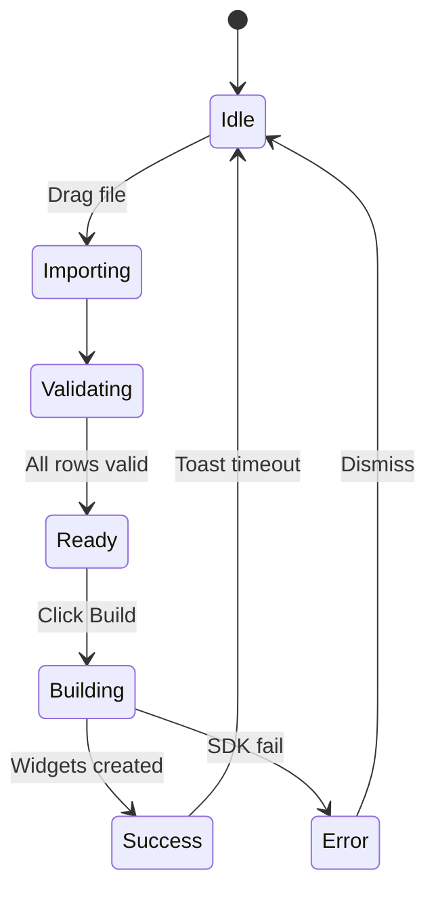

# Sidebar Tabs — Detailed Functional Blueprint

_Explicit UI + interaction walkthrough for every tab (June 2025)_

This document narrows focus to the **five sidebar tabs** in the Quick Tools
add‑on. Each tab section specifies panel layout, visible controls, states,
interaction flows, tool‑tips, keyboard shortcuts and validation rules—so any
developer can translate designs into code with zero ambiguity.

---

## Legend

- **UI Element** – Visual component to render (exact design-system
  component/class).
- **Copy (EN‑AU)** – Literal text shown to users.
- **Interaction Flow** – Ordered user actions → system responses.
- **State Store** – Redux slice / React context field.
- **Shortcut** – Keyboard binding (Mac / Win).

---

Each page component wraps its content in a `TabPanel` wrapper which sets
`role="tabpanel"` and links the panel to its controlling tab. Preview the tab
layouts under **Pages/Tabs** in Storybook.

## 1  Diagrams Tab

| Step | UI Element         | Copy (EN‑AU)                           | Interaction Flow                               | State Store   |
| ---- | ------------------ | -------------------------------------- | ---------------------------------------------- | ------------- |
| 1    | `<TabBar>` sub-nav | “Structured”, “Cards”, “Layout Engine” | Choose sub-tab                                 | `createMode`  |
| 2    | `<DropZone>` area  | "Drag a .json file"                    | Drag file → highlight border; on drop validate | `importQueue` |
| 3    | Structured options | as per old Diagram tab                 | Layout settings + build button                 | –             |
| 4    | Cards options      | as per old Cards tab                   | Search, tag filter and create button           | –             |
| 5    | Layout Engine      | Placeholder text                       | Coming soon                                    | –             |

**Tooltip for invalid row** – "Edge refers to missing node '‘%id%’.'" Shortcut:
**⌘/** toggles the **Advanced options** accordion on the Diagram tab.

---

## 2  Tools Tab

Combines resizing, style tweaks, arranging widgets and frame utilities. Tabs
within this section mirror the previous individual tabs.

### 2.1 Resize

As per the former **Resize Tab** with width/height inputs, aspect ratio and copy
functions.

### 2.2 Colours

Brightness slider and preset buttons from the old **Style Tab**.

### 2.3 Arrange

Grid and spacing controls previously found in the **Arrange Tab**.

### 2.4 Frames

Prefix rename and locking options from the old **Frames Tab**.

---

## 3  Excel Tab

Allows importing nodes from Excel workbooks. Choose a sheet, map columns and
create widgets. Edits on the board sync back via `ExcelSyncService`.

## 4  Search Tab

| Control            | Details                                            |
| ------------------ | -------------------------------------------------- |
| **Find Input**     | Text to locate on the board; regex toggle embedded |
| **Replace Input**  | Replacement text applied in bulk; respects regex   |
| **Filters Menu**   | Icon button opens advanced options                 |
| **Next Button**    | Scrolls board to next match                        |
| **Replace Button** | Replace the highlighted match only                 |
| **Replace All**    | Calls `replaceBoardContent` utility                |

Flow: typing in the **Find** field debounces `searchBoardContent` by 300 ms and
updates the match count. The **Next** button cycles through results and zooms
the board to each widget. **Replace** updates just the current item via
`replaceBoardContent` with `inSelection` pointing to that widget. When the regex
toggle is enabled replacements match the regular expression.

## 5  Help Tab

Shows a getting started guide and a collapsible changelog.

---

## Global Keyboard Shortcuts

| Action          | Mac | Win/Linux |
| --------------- | --- | --------- |
| Undo            | ⌘Z  | CtrlZ     |
| Redo            | ⌘⇧Z | Ctrl⇧Z    |
| Copy Size       | ⌥C  | AltC      |
| Apply Size      | ⌥V  | AltV      |
| Command Palette | ⌘K  | CtrlK     |

## Board Actions

| Action        | Location                    | Result                                                |
| ------------- | --------------------------- | ----------------------------------------------------- |
| Edit Metadata | Context menu or app command | Opens the Edit Metadata modal for the selected widget |

---

## Validation & Error Summary

1. **File type** – Only .json/.csv/.mmd accepted; else toast “Unsupported file
   type”.
2. **Graph cycles** – Detect self‑loops; prompt “Cannot layout self‑loop. Break
   edge?”
3. **Selection empty** – Tabs with selection‑based actions show banner: “Select
   items to enable controls.”
4. **Network fail (Data Tab)** – Red status badge, retry logic 3× exponential
   backoff.

---

## State Diagram

---

_Keep this blueprint adjacent to the codebase; update whenever controls or flows
change._
